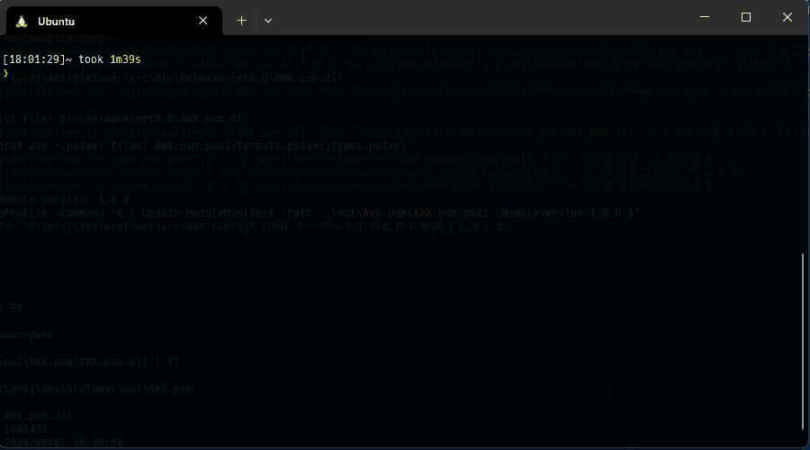

# Jagabata.psm 🥔🧈

PowerShell module to operate AWX/AnsibleTower using [Rest API].
 

## 🚀 Build

See [Build](./docs/en-US/build.md) document.

## ⚙️ Settings

See [Settings](./docs/en-US/settings.md) document.

## 🛠️ Commands

Many commands (over 100) are available.

See [Cmdlet documents(en-US)](./docs/en-US/cmdlets/Jagabata.psm.md) for all command list.

[Rest API]: https://ansible.readthedocs.io/projects/awx/en/latest/rest_api/index.html "AWX API Reference — Ansible AWX community documentation"
