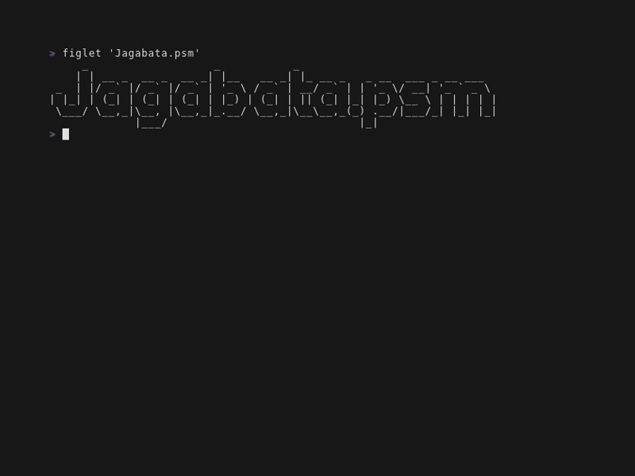
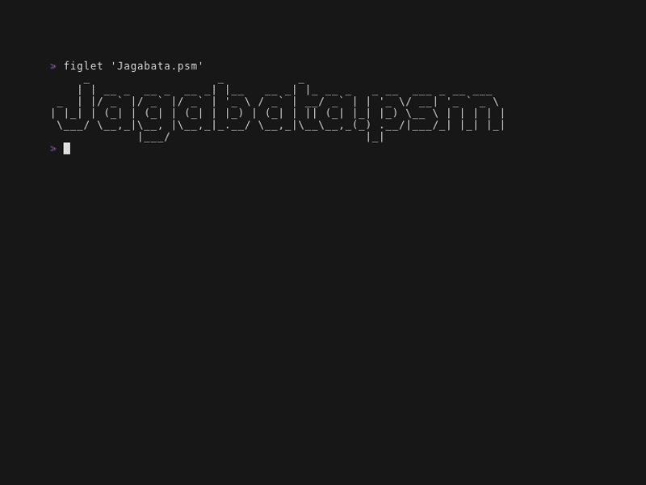

# 🎥 Demo movies

Demonstration videos taken using [vhs](https://github.com/charmbracelet/vhs "charmbracelet/vhs: Your CLI home video recorder 📼").

## Create config file

This demo creates a configuration file that should be created first in using this Jagabata.psm.
To get a Personal Access Token (PAT), see [settings](../en-US/settings.md).

## Invoke JobTemplate

Demo of Synchronous job execution
using [Invoke-AnsibleJobTemplate](../en-US/cmdlets/Invoke-AnsibleJobTemplate.md) which launch the JobTemplate and **wait** the job is finished.

## Start JobTemplate

Demo of Asynchronous job execution
using [Start-AnsibleJobTemplate](../en-US/cmdlets/Start-AnsibleJobTemplate.md) which launch the JobTemplate but **not wait** the job is finished.
And then wait the job is finished using [Wait-AnsibleUnifiedJob](../en-US/cmdlets/Wait-AnsibleUnifiedJob.md)

