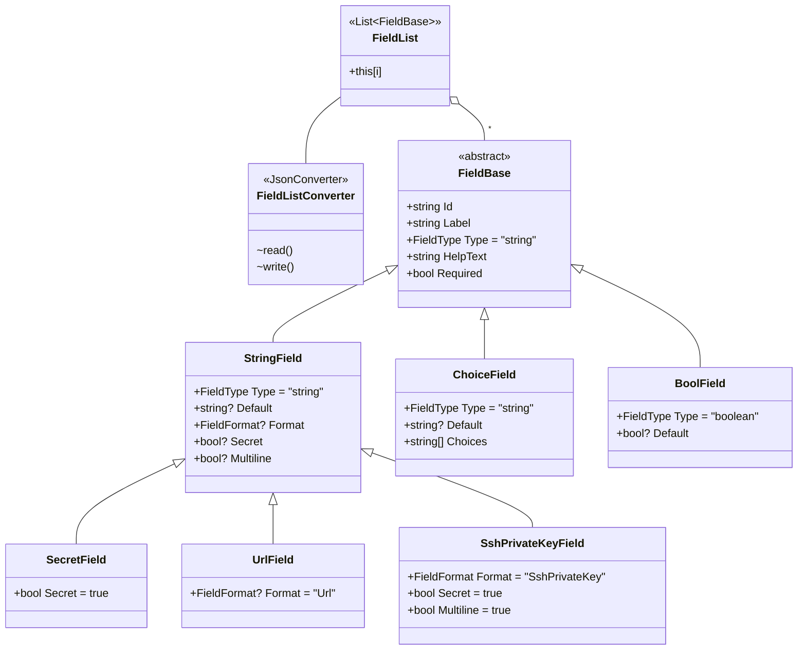

# Creating CredentialType

To create CredentialType, we need to define `inputs` and `injectors` data.

## Custom Credential Type Inputs

The specification: https://github.com/ansible/awx/blob/devel/docs/credentials/custom_credential_types.md#defining-custom-credential-type-inputs

> A `Credential Type` specifies an `inputs` schema which defines a set of ordered fields for that type:
> ```yaml
> "inputs": {
>     "fields": [{
>         "id": "api_token",               # required - a unique name used to
>                                          # reference the field value
> 
>         "label": "API Token",            # required - a unique label for the
>                                          # field
> 
>         "help_text": "User-facing short text describing the field.",
> 
>         "type": ("string" | "boolean")   # defaults to 'string'
> 
>         "format": "ssh_private_key"      # optional, can be used to enforce data
>                                          # format validity for SSH private key
>                                          # data (only applicable to `type=string`)
> 
>         "secret": true,                  # if true, the field value will be encrypted
> 
>         "multiline": false               # if true, the field should be rendered
>                                          # as multi-line for input entry
>                                          # (only applicable to `type=string`)
> 
>         "default": "default value"       # optional, can be used to provide a
>                                          # default value if the field is left empty;
>                                          # when creating a credential of this type,
>                                          # credential forms will use this value
>                                          # as a prefill when making credentials of
>                                          # this type
>     },{
>         # field 2...
>     },{
>         # field 3...
>     }]
>     "required": ["api_token"]            # optional; one or more fields can be marked as required
> },
> ```
> When `type=string`, fields can optionally specify multiple choice options:
> ```yaml
> "inputs": {
>     "fields": [{
>         "id": "api_token",          # required - a unique name used to reference the field value
>         "label": "API Token",       # required - a unique label for the field
>         "type": "string",
>         "choices": ["A", "B", "C"]
>     }]
> },
> ```

There are helper classes that make the generation of these `fields` and `required` properties a little easier.

### Classes
Namespace: `Jagabata.CredentialType`:
- `Jagabata.CredentialType.FieldList`: container for `fields` and `required` properties
- `Jagabata.CredentialType.BoolField`: boolean field (rendered as Checkbox)
- `Jagabata.CredentialType.StringField`: string input field (rendered as Input box)
  - `Jagabata.CredentialType.SecretField`: confidential information input field (`secret=true`)
  - `Jagabata.CredentialType.UrlField`: URL input field (`format=url`)
  - `Jagabata.CredentialType.SshPrivateKeyField`: input field for SSH key (`secret=true`, `multiline=true`, `format=ssh_private_key`)
- `Jagabata.CredentialType.ChoiceField`: multiple choice field (rendered as Select box)

### Example
```powershell
$list = [Jagabata.CredentialType.FieldList]::new();

# Add normal input field
$list.Add([Jagabata.CredentialType.StringField]@{ Id = "username"; Label = "User Name"; Required = $true })

# Add password input field
$list.Add([Jagabata.CredentialType.SecretField]@{ Id = "password"; Label = "Password"; Required = $true })

New-AnsibleCredentialType -Name "Demo-1" -Kind cloud -Inputs $list -WhatIf
```

```Output
What if: Performing the operation "New-AnsibleCredentialType" on target "{
  "name": "Demo 1",
  "kind": "cloud",
  "injectors": {},
  "inputs": {
    "fields": [
      {
        "id": "username",
        "label": "User Name",
        "type": "string"
      },
      {
        "secret": true,
        "id": "password",
        "label": "Password",
        "type": "string"
      }
    ],
    "required": [
      "username",
      "password"
    ]
  }
}".
```

### Class Diagram


This is only an overview diagram and differs from the actual class diagram.

## Custom Credential Type Injectors

The specification: https://github.com/ansible/awx/blob/devel/docs/credentials/custom_credential_types.md#defining-custom-credential-type-injectors

### Classes

Namespace: `Jagabata.CredentialType`:
- `Jagabata.CredentialType.Injectors`: container for `env`, `extra_vars` or `file` properties

```powershell
$injectors = [Jagabata.CredentialType.Injectors]::new();
$injectors.Env = @{
  MY_CLOUD_INI_FILE = "{{ tower.filename }}"
}
$injectors.File = @{
  template = @(
    "[mycloud]",
    "token={{ api_token }}"
  ) -join "`n"
}
$injectors.ExtraVars = @{ 
  some_extra_var = "{{ username }}:{{ password }}";
  auth = @{
    username = "{{ username }}";
    password = "{{ password }}";
  }
}
```

