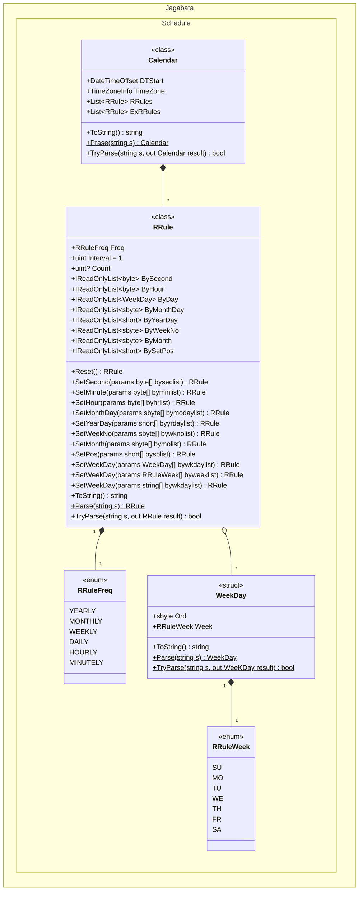

# Creating Schedule

To create schedules for JobTemplates, ProjectUpdate and others,
use `-RRule` parameter of [New-AnsibleSchedule], [Update-AnsibleSchedule] basicly.

However, it is difficult to create a string of `-RRule` parameters that define the calendar rules.
Therefore, I prepared helper classes that allow new creation and editing.

## `-RRule` parameter

The `-RRule` parameter string consists of several elements.

- `DTSTART`: sets the start date and time.
- `RRULE`: sets the recurrence rule. (can set multiple)
- `EXRULE`: sets the exclusion rule. (can set multiple)

## ⚠️ CAUTION

Can create complex rules and they will probably work correctly, but they may not show up correctly on the Web UI of AWX / AnsibleTower.

## Helper classes

Namespace: `Jagabata.Schedule`

### Create New Calendar Rule

Use the `Jagabata.Schedule.Calendar` class to create a new calendar rule.
This class defines `DTSTART` and stores `RRULE`s and `EXRULE`s.

#### Define `DTSTART`

First of all, define `DTSART` as the start date and time.
Time zone is automatically calculated from the execution environment.

```powershell
$cal = [Jagabata.Schedule.Calendar]::new([datetime]"2025-03-10 21:30");
# Same as:
#   $cal = [Jagabata.Schedule.Calendar]::new((Get-Date "2025-03-10 21:30"))

$cal.ToString();
```

```Output
DTSTART;TZID=Asia/Tokyo:20250310T213000
```

#### Add RRules (or EXRules)

Next, add `RRule`s or `EXRule`s.

```powershell
$rrule = [Jagabata.Schedule.RRule]::new([Jagabata.Schedule.RRuleFreq]::Monthly);
$rrule.SetWeekDay("SA", "SU") | Out-Null;
# Same as:
#   $rrule = ([Jagabata.Schedule.RRule]@{ Freq = "Monthly" }).AddWeekDay("SA", "SU")
$cal.RRules.Add($rrule);

$cal.ToString();
```

```Output
DTSTART;TZID=Asia/Tokyo:20250310T213000 RRULE:FREQ=MONTHLY;INTERVAL=1;BYDAY=SA,SU
```

#### Check schedules

You may be wondering what the schedule will look like for the calendar rule you created.
Can check it out by [Show-AnsibleSchedule].

```powershell
Show-AnsibleSchedule -RRule $cal 
```

```Output
Local                                    Utc
-----                                    ---
2025-03-15T21:30:00+09:00                2025-03-15T12:30:00Z
2025-03-16T21:30:00+09:00                2025-03-16T12:30:00Z
2025-03-22T21:30:00+09:00                2025-03-22T12:30:00Z
2025-03-23T21:30:00+09:00                2025-03-23T12:30:00Z
2025-03-29T21:30:00+09:00                2025-03-29T12:30:00Z
2025-03-30T21:30:00+09:00                2025-03-30T12:30:00Z
2025-04-05T21:30:00+09:00                2025-04-05T12:30:00Z
2025-04-06T21:30:00+09:00                2025-04-06T12:30:00Z
2025-04-12T21:30:00+09:00                2025-04-12T12:30:00Z
2025-04-13T21:30:00+09:00                2025-04-13T12:30:00Z
```

#### Register the schedules

Use [New-AnsibleSchedule] (or [Update-AnsibleSchedule]) for registering the schedules.

### Edit existing schedules

#### Get schedule

```powershell
$schedule = Get-AnsibleSchedule -Id 1
$schedule | fl Id,Name,Rrule
```

```Output
Id    : 1
Name  : Cleanup Job Schedule
Rrule : DTSTART:20231104T071908Z RRULE:FREQ=WEEKLY;INTERVAL=1;BYDAY=SU
```

#### Convert `RRule` string to `Calendar` and `RRule` objects

```powershell
$cal = [Jagabata.Schedule.Calendar]::Parse($schedule.Rrule)
# Same as:
#   $cal = [Jagabata.Schedule.Calendar]$schedule.Rrule

$cal | fl
```

```Output
DTStart  : 11/04/2023 07:19:08 +00:00
TimeZone : (UTC) Coordinated Universal Time
RRules   : {FREQ=WEEKLY;INTERVAL=1;BYDAY=SU}
ExRRules : {}
```

#### Edit

```powershell
$cal.RRules[0].SetWeekDay("SA").SetHour(21).SetMinute(30) | Out-Null;
Show-AnsibleSchedule -RRule $cal
```

```Output
Local                                    Utc
-----                                    ---
2024-11-09T21:30:08Z                     2024-11-09T21:30:08Z
2024-11-16T21:30:08Z                     2024-11-16T21:30:08Z
2024-11-23T21:30:08Z                     2024-11-23T21:30:08Z
2024-11-30T21:30:08Z                     2024-11-30T21:30:08Z
2024-12-07T21:30:08Z                     2024-12-07T21:30:08Z
2024-12-14T21:30:08Z                     2024-12-14T21:30:08Z
2024-12-21T21:30:08Z                     2024-12-21T21:30:08Z
2024-12-28T21:30:08Z                     2024-12-28T21:30:08Z
2025-01-04T21:30:08Z                     2025-01-04T21:30:08Z
2025-01-11T21:30:08Z                     2025-01-11T21:30:08Z
```

## Class Diagram



[New-AnsibleSchedule]: cmdlets/New-AnsibleSchedule.md
[Update-AnsibleSchedule]: cmdlets/Update-AnsibleSchedule.md
[Show-AnsibleSchedule]: cmdlets/Show-AnsibleSchedule.md
