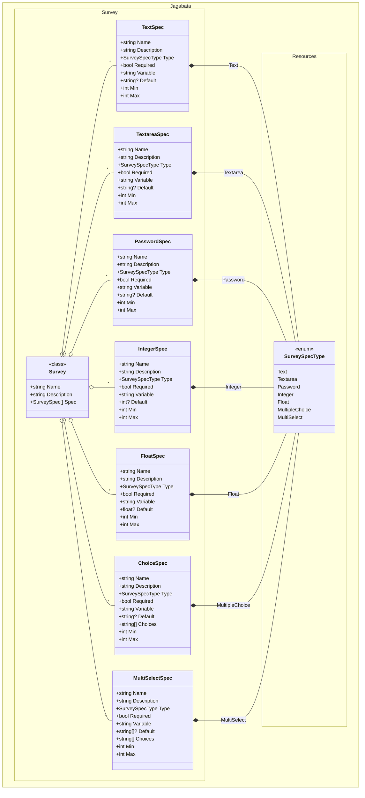

# Survey

JobTemplate and WorkflowJobTemplate can have Surveys that prompts questions at launch.

This document is about creating and editing the Survey specs.

## Create New Surveys
### 1. Create Survey Container

```powershell
$surveys = [Jagabata.Survey.Survey]::new()
$surveys | fl
```

```Output
Name        :
Description :
Spec        :
```

### 2. Add Survey specs

The following classes are available for creating Surveys:

- `TextSpec`: for Text
- `TextareaSpec`: for Textarea
- `PasswordSpec`: for Password
- `IntegerSpec`: for integer number
- `FloatSpec`: for floating-point number
- `ChoiceSpec`: for choicing an item
- `MultiSelectSpec`: for selecting multi items

```powershell
# Survey of Text
$survey.Spec += [Jagabata.Survey.TextSpec]@{ Name = "User Name"; Variable = "user_name"; Required = $true; Default = "default_user_name" }

# Survey of Password
$survey.Spec += [Jagabata.Survey.PasswordSpec]@{ Name = "Password"; Variable = "passowrd"; Required = $true }

# Survey of Integer number
$survey.Spec += [Jagabata.Survey.IntegerSpec]@{ Name = "Somthing Count"; Variable = "count"; Default = 10; Min = 1; Max = 100 }

# Survey of Floating-point number
$survey.Spec += [Jagabata.Survey.FloatSpec]@{ Name = "Float"; Variable = "float_number" }

# Survey of Choice (Only one selectable)
## Default value must be contained in Choices items, so need to initialize as ordered dictionary (define Default after Choices)
$survey.Spec += [Jagabata.Survey.ChoiceSpec][ordered]@{ Name = "Select One"; Variable = "item"; Choices = @("A", "B", "C"); Default = "B"; Required=$true }

# Survey of MultiSelect (Multiple selectable)
## Default value must be contained in Choices items, so need to initialize as ordered dictionary (define Default after Choices)
$survey.Spec += [Jagabata.Survey.MultiSelectSpec][ordered]@{ Name = "Multi Select"; Variable = "items"; Choices = "A","B","C"; Default="B","C"; }

# Survey of Textarea (can input multi lines)
$survey.Spec += [Jagabata.Survey.TextareaSpec]@{ Name = "Message"; Variable="message"; }

$survey | fl
```

```Output
Name        : Survey name
Description : Survery description
Spec        : Name           Description           Type Required Variable     Default           Choices   Min  Max
              ----           -----------           ---- -------- --------     -------           -------   ---  ---
              User Name                            Text     True user_name    default_user_name             0 1024
              Password                         Password    False passowrd                                   0 1024
              Somthing Count                    Integer    False count        10                            1  100
              Float                               Float    False float_number 0                             0 1024
              Select One                 MultipleChoice     True item         B                 {A, B, C}   0 1024
              Multi Select                  MultiSelect    False items        {B, C}            {A, B, C}   0 1024
              Message                          Textarea    False message                                    0 1024
```

### 3. Register surveys

```powershell
Register-AnsibleSurveySpec -Template @{Type="JobTemplate"; Id=10} -Survey $survey
```

### 4. Enable/Disable surveys

```powershell
Update-AnsibleJobTemplate -SurveyEnabled $true # or $false
```

## Edit Existing Surverys

### 1. Get surveys

```powershell
$survey = Get-AnsibleSurveySpec -Type JobTemplate -Id 10
```

### 2. Edit

```powershell
## Add
$survey.Spec += [Jagabata.Survey.TextSpec]@{ .... }

## Swap or Remove
$survey.Spec = $survey.Spec[0, 3, 2]
```

### 3. (Re)Register survey

```powershell
Register-AnsibleSurveySpec -Template @{Type="JobTemplate";Id=10} -Survey $survey
```

## Class Diagram



This is only an overview diagram and differs from the actual class diagram.


